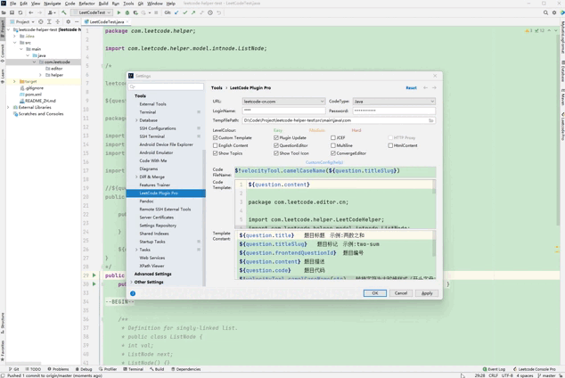

## 简介 
方便的在idea Debug LeetCode的题目
### 使用说明
- 单独使用：调用[main](https://gitee.com/cuigaoshun/leetcode-helper-test/blob/master/src/main/java/com/leetcode/helper/LeetCodeTest.java)方法即可
- 配合idea插件[leetcode editor](https://gitee.com/shuzijun/leetcode-editor)使用

